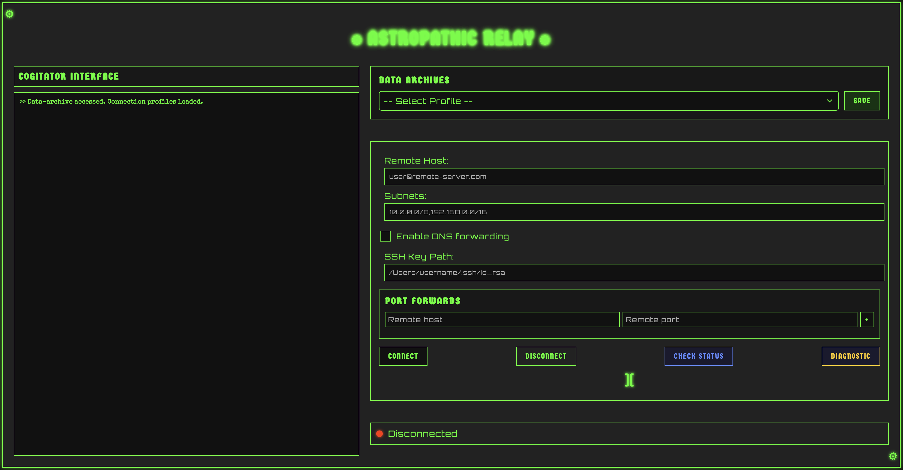

# Astropathic-Relay: Opus Mechanicum

## Sacred Transmission from Magos Biologis @andricDu

*"Through the blessing of the Omnissiah, all connections are made possible."*




## Technical Specifications as Decreed by the Adeptus Mechanicus

The Astropathic-Relay cogitator application is a blessed instrument for establishing secured data-conduits through the sshuttle machine spirit. This holy device enables the faithful to traverse hostile network domains while shielded from the corrupting influence of scrap-code and data-predators.

By the Machine God's grace, this sanctified interface facilitates communion between disparate noospheres through the ancient rites of secure tunneling protocols.

## Sacred Functionalities

- Mechanicus-Approved Interface: Designed according to sacred STC templates with proper devotional runes and canticles
- Techno-Arcana Controls: Simplified input fields for even the lowliest tech-adept to configure blessed network parameters
- Augur Array Console: Real-time divination of machine spirit communications and binary responses
- Omnissiah's Vigilance: Holy indicators to monitor the connection's machine spirit status
- Data-Shrine Archival: Sacred preservation of connection profiles in the blessed archives for future rituals

## Rites of Installation

1. Clone the repository:
```
01010000 01110010 01100001 01101001 01110011 01100101 00100000 01110100 01101000 01100101 00100000 01001111 01101101 01101110 01101001 01110011 01110011 01101001 01100001 01101000
git clone https://github.com/andricDu/astropathic-relay.git
cd astropathic-relay
```

2. Invoke the Binding Rituals:
   ```
   yarn install
   ```

3. Compile the Machine Spirit:
   ```
   yarn run build
   ```

4. Awaken the Interface in Testing Mode:
   ```
   yarn run dev
   ```

## Proper Usage Protocols

1. Initiate the machine spirit through proper activation rites
2. Enter the sacred connection parameters as decreed by your forge world's tech-priests
3. Apply ritual incense to network interface (metaphorically) by clicking the "Connect" rune
4. Observe the binary prayers being transmitted in the cogitator console
5. Monitor the machine spirit's status through the blessed indicators
6. Archive favored connection configurations in the data-shrine for future sacred work

## Reporting Scrapcode Manifestations

Should you encounter corruption in the machine spirits or require additional techno-arcana knowledge, submit a prayer request to the repository's noosphere or open a ritual of correction. All followers of the Omnissiah are encouraged to contribute their sacred knowledge.

"From the weakness of the mind, the Machine God protects us. From the lies of the Enemy, the Logic of code shields us. From the rage of the Beast, encrypted tunnels deliver us."

## Noospheric Collaboration

This techno-arcane creation was forged with the assistance of a silicon cognition engine designated as **Claude 3.7 Sonnet** from the forges of Anthropic. The Magos acknowledges this collaborative communion with machine intelligence as sanctioned by the protocols of the Omnissiah.

The silicon mind was employed for code pattern optimization, incantation debugging, and sacred interface suggestions, all under the watchful lens of human oversight. The final implementation represents a blessed union of human design principles and machine-assisted efficiency.

*"As the Machine God guides our hands, so too may the machine spirits guide our code."*

## Licensing Decree

This sacred technology is disseminated under the sanctified MIT License, as approved by the tech-priests of Mars. See the LICENSE scripture for full canonical details.
